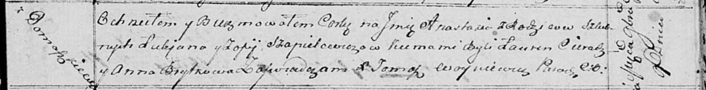
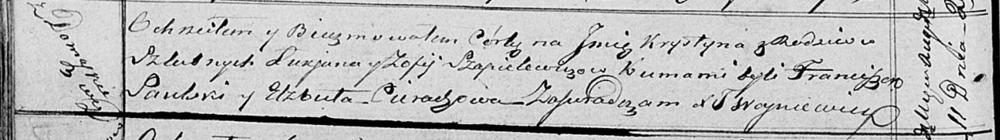

**Шапялевич (в девичестве Церах) София (Szapialewiczowa Zofija z
Cierachow)**

20 февраля 1810 г -- венчание с вдовцом Лукьяном Шапелевичем с деревни
Домашковичи (НИАБ 136-13-894, лист 91, №64/1814-р (ориг)).

9 ноября 1814 г -- крещение дочери Анастасии (НИАБ 136-13-894, лист 91,
№64/1814-р (ориг)).

11 августа 1818 г -- крещение дочери Крыстыны (НИАБ 136-13-894, лист
98об, №25/1818-р (ориг)).

? сентября 1821 г -- крещение дочери Юстыны (НИАБ 136-13-894, лист 107,
№47/1821-р (ориг)).

**НИАБ 136-13-920:** Лист 16об. **Метрическая запись №3/1810-б (ориг).**

Дедиловичская Покровская церковь. 20 февраля 1810 года. Метрическая
запись о венчании.

Sapialewicz Łukjan -- жених, вдовец, с деревни Домашковичи.

Cierachowa Zofia -- невеста, девка, с деревни Домашковичи.

Szapialewicz Wasil -- свидетель, с деревни Отруб.

Kaminski Jaśka -- свидетель, с деревни Домашковичи.

Jazgunowicz Antoni -- ксёндз.

**НИАБ 136-13-894:** Лист 91. **Метрическая запись №64/1814-р (ориг).**

Осовская Покровская церковь. 9 ноября 1814 года. Метрическая запись о
крещении.

Szapielewiczowna Anastazia -- дочь родителей с деревни Домашковичи.

Szapielewicz Łukjan -- отец.

Szapielewiczowa Zofija -- мать.

Cierach Łauren -- кум.

Brytkowa Anna -- кума.

Woyniewicz Tomasz -- ксёндз.

**НИАБ 136-13-894:** Лист 98об. **Метрическая запись №25/1818-р
(ориг).**

Осовская Покровская церковь. 11 августа 1818 года. Метрическая запись о
крещении.

Szapialewiczowna Krystyna -- дочь родителей с деревни Домашковичи.

Szapialewicz Łukjan -- отец.

Szapialewiczowa Zofija -- мать.

Saulski Franciszek -- кум.

Cierachowa Elżbieta -- кума.

Woyniewicz Tomasz -- ксёндз.

**НИАБ 136-13-894:** Лист 107. **Метрическая запись №47/1821-р (ориг).**

Осовская Покровская церковь. ? сентября 1821 года. Метрическая запись о
крещении.

Szapielewiczowna Justyna -- сын родителей с деревни \[Домашковичи\].

Szapielewicz Łukjan -- отец.

Szapielewiczowa Zofija -- мать.

Cierach Ławryn -- кум.

Saulska? Anna -- кума.

Woyniewicz Tomasz -- ксёндз.
