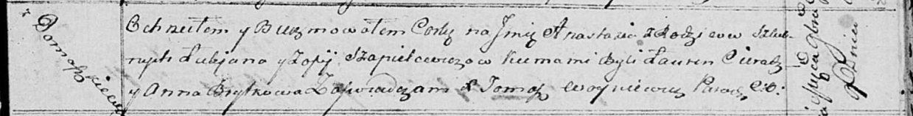

**Шапялевич Юстына Лукьянова (Szapialewiczowna Justyna)**

? сентября 1821 г -- крещение (НИАБ 136-13-894, лист 107, №47/1821-р
(ориг)).

**НИАБ 136-13-894:** Лист 107. **Метрическая запись №47/1821-р (ориг).**

{width="6.496527777777778in"
height="1.2183081802274716in"}

Осовская Покровская церковь. ? сентября 1821 года. Метрическая запись о
крещении.

Szapielewiczowna Justyna -- сын родителей с деревни \[Домашковичи\].

Szapielewicz Łukjan -- отец.

Szapielewiczowa Zofija -- мать.

Cierach Ławryn -- кум.

Saulska? Anna -- кума.

Woyniewicz Tomasz -- ксёндз.
