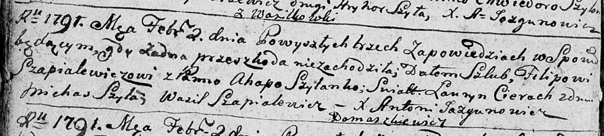

**Шапелевич Филип (Szapielewicz Filip)**

2 февраля 1791 г -- венчание с Агапой Шило (НИАБ 136-13-894, лист 69об,
№8/1791-б (ориг)).

**НИАБ 136-13-894:** Лист 69об. **Метрическая запись №8/1791-б (ориг).**

Дедиловичская Покровская церковь. 2 февраля 1791 года. Метрическая
запись о венчании.

Szapialewicz Filip -- жених, с деревни Домашковичи.

Szyłanka Ahapa -- невеста.

Cierach Łauryn -- свидетель.

Szyło Michaś -- свидетель.

Szapialewicz Wasil -- свидетель.

Jazgunowicz Antoni -- ксёндз.
