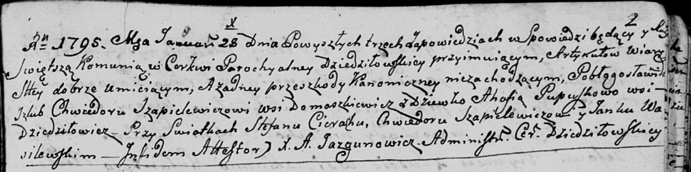
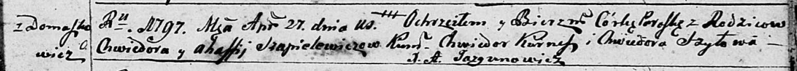
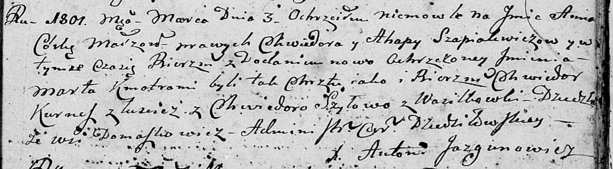
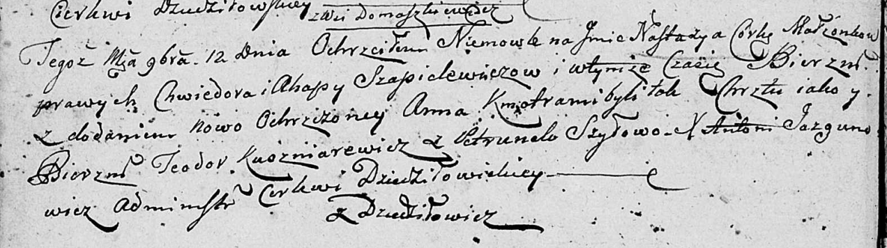
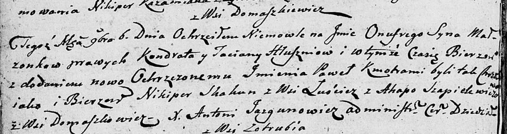
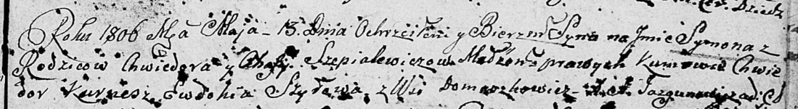

**Шапелевич (Пупушко) Агафия (Szapielewiczowa, Szepialewiczowa Ahaffia,
Ahapa z Pupuszkow)**

28 января 1795 г -- венчание с Хведором Шапелевичем с деревни
Домашковичи (НИАБ 136-13-920, лист 2, №2/1795-б (ориг)).

27 апреля 1797 г -- крещение дочери Параски (НИАБ 136-13-894, лист 33,
№28/1797-р (ориг)).

3 марта 1801 г -- крещение дочери Анны Марты (НИАБ 136-13-894, лист 43,
№8/1801-р (ориг)).

12 ноября 1803 г -- крещение дочери Настасьи Анны (НИАБ 136-13-894, лист
52об, №47/1803-р (ориг)).

6 ноября 1804 г -- возможно, крестная мать Онуфрыя Павла, сына Глушеней
Кондрата и Татьяны с деревни Домашковичи (НИАБ 136-13-894, лист 55об,
№53/1804-р (ориг)).

13 мая 1806 г -- крещение сына Сымона (НИАБ 136-13-894, лист 60,
№25/1806-р (ориг)).

**НИАБ 136-13-920:** Лист 2. **Метрическая запись №2/1795-б (ориг).**

Дедиловичская Покровская церковь. 28 января 1795 года. Метрическая
запись о венчании.

Szapiełewicz Chwiedor -- жених, деревня Домашковичи.

Pupuszkowa Ahafia -- невеста, девка, деревня Дедиловичи.

Cierach Stefan -- свидетель.

Szapiełewicz Chwiedor -- свидетель.

Wasiłewski Janka -- свидетель.

Jazgunowicz Antoni -- ксёндз.

**НИАБ 136-13-894:** Лист 33. **Метрическая запись №28/1797-р (ориг).**

Дедиловичская Покровская церковь. 27 апреля 1797 года. Метрическая
запись о крещении.

Szapielewiczowna Paraska -- дочь родителей с деревни Домашковичи.

Szapielewicz Chwiedor -- отец.

Szapielewiczowa Ahaffia -- мать.

Kurnesz Chwiedor - кум.

Szyłowa Chwiedora - кума.

Jazgunowicz Antoni -- ксёндз.

Лист 43. **Метрическая запись №8/1801-р (ориг).**

Дедиловичская Покровская церковь. 3 марта 1801 года. Метрическая запись
о крещении.

Szapialewiczowa Anna Marta -- дочь родителей с деревни Домашковичи.

Szapialewicz Chwiedor -- отец.

Szapialewiczowa Ahapa -- мать.

Kurnesz Chwiedor -- кум, с деревни Лустичи.

Szyłowa Chwiedora -- кума, с деревни Васильковка.

Jazgunowicz Antoni -- ксёндз.

**НИАБ 136-13-894:** Лист 52об. **Метрическая запись №47/1803-р
(ориг).**

Дедиловичская Покровская церковь. 12 ноября 1803 года. Метрическая
запись о крещении.

Szapielewiczowna Nastazyja Anna -- дочь родителей с деревни Домашковичи.

Szapielewicz Chwiedor -- отец.

Szapielewiczowa Ahapa -- мать.

Kuszniarewicz Teodor -- кум.

Szyłowa Petrunela -- кума.

Jazgunowicz Antoni -- ксёндз.

**НИАБ 136-13-894:** Лист 55об. **Метрическая запись №53/1804-р
(ориг).**

Дедиловичская Покровская церковь. 6 ноября 1804 года. Метрическая запись
о крещении.

Hłuszeń Onufry Paweł -- сын родителей с деревни Домашковичи.

Hłuszeń Kondrat -- отец.

Hłuszniowa Taciana -- мать.

Skakun Nikiper -- кум, с деревни Лустичи.

Szapielewiczowa Ahapa -- кума, с деревни Домашковичи.

Jazgunowicz Antoni -- ксёндз.

**НИАБ 136-13-894:** Лист 60. **Метрическая запись №25/1806-р (ориг).**

Дедиловичская Покровская церковь. 13 мая 1806 года. Метрическая запись о
крещении.

Szepialewicz Symon -- сын родителей с деревни Домашковичи.

Szepialewicz Chwiedor -- отец.

Szepialewiczowa Ahafija -- мать.

Kurnesz Chwiedor -- кум.

Szyłowa Ewdokija -- кума.

Jazgunowicz Antoni -- ксёндз.
