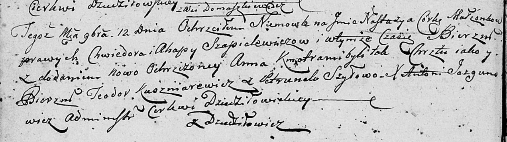

**Шапелевич Настасья Хведорова (Szapielewiczowna Nastazya Anna)**

12 ноября 1803 г -- крещение (НИАБ 136-13-894, лист 52об, №47/1803-р
(ориг)).

**НИАБ 136-13-894:** Лист 33. **Метрическая запись №28/1797-р (ориг).**

Дедиловичская Покровская церковь. 27 апреля 1797 года. Метрическая
запись о крещении.

Szapielewiczowna Paraska -- дочь родителей с деревни Домашковичи.

Szapielewicz Chwiedor -- отец.

Szapielewiczowa Ahaffia -- мать.

Kurnesz Chwiedor - кум.

Szyłowa Chwiedora - кума.

Jazgunowicz Antoni -- ксёндз.

Лист 43. **Метрическая запись №8/1801-р (ориг).**

Дедиловичская Покровская церковь. 3 марта 1801 года. Метрическая запись
о крещении.

Szapialewiczowa Anna Marta -- дочь родителей с деревни Домашковичи.

Szapialewicz Chwiedor -- отец.

Szapialewiczowa Ahapa -- мать.

Kurnesz Chwiedor -- кум, с деревни Лустичи.

Szyłowa Chwiedora -- кума, с деревни Васильковка.

Jazgunowicz Antoni -- ксёндз.

**НИАБ 136-13-894:** Лист 52об. **Метрическая запись №47/1803-р
(ориг).**

Дедиловичская Покровская церковь. 12 ноября 1803 года. Метрическая
запись о крещении.

Szapielewiczowna Nastazyja Anna -- дочь родителей с деревни Домашковичи.

Szapielewicz Chwiedor -- отец.

Szapielewiczowa Ahapa -- мать.

Kuszniarewicz Teodor -- кум.

Szyłowa Petrunela -- кума.

Jazgunowicz Antoni -- ксёндз.
