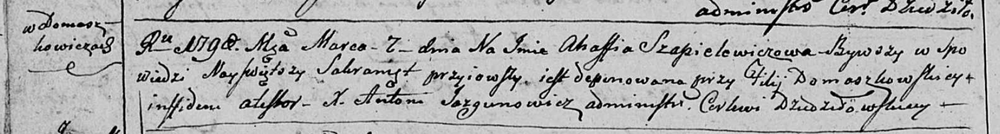

**Шапелевич Агафия (Szapiаlewiczowa Ahafia)**

7 марта 1798 г -- отпевание (НИАБ 136-13-919, лист 7об, №6/1798-у
(ориг)).

**НИАБ 136-13-919:** Лист 7об. **Метрическая запись №6/1798-у (ориг).**

Дедиловичская Покровская церковь. 7 марта 1798 года. Метрическая запись
об отпевании.

Szapielewiczowa Ahafia -- умершая, с деревни Домашковичи, похоронена на
кладбище при филии Домашковичской.

Jazgunowicz Antoni -- ксёндз.
