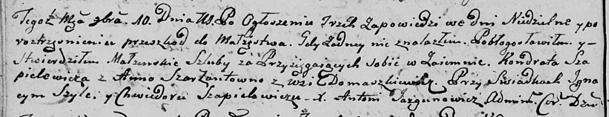

**Шапелевич (Шарант) Анна (Szapielewiczowa (Szarzantowna) Anna)**

10 ноября 1801 г -- венчание с Кондратом Шапелевичем с деревни
Дедиловичи (НИАБ 136-13-920, лист 7об, №6/1801-б (ориг)).

**НИАБ 136-13-920:** Лист 7об. **Метрическая запись №6/1801-б (ориг).**

Дедиловичская Покровская церковь. 10 ноября 1801 года. Метрическая
запись о венчании.

Szapielewicz Kondrat -- жених, с деревни \[Дедиловичи\].

Szarzantowna Anna -- невеста, с деревни Домашковичи.

Szyła Jgnacy -- свидетель.

Szapielewicz Chwiedor -- свидетель.

Jazgunowicz Antoni -- ксёндз.
