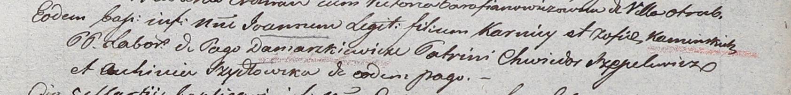

**Шидловская Авхиня (Szydłowska Auchinia)**

22 февраля 1803 г -- крестная мать Иоанна, сына Карнея и Софии Каминских
с деревни Домашковичи (НИАБ 937-4-32, лист 9, №5/1803-р).

**НИАБ 937-4-32:** Лист 9. **Метрическая запись №5/1803-р.**

Дедиловичский костел Наисвятейшего Сердца Иисуса. 22 февраля 1803 года.
Метрическая запись о крещении.

Kaminski Joann -- сын крестьян с деревни Домашковичи.

Kaminski Korniey -- отец.

Kaminska Zofia -- мать.

Szepelewicz Chwiedor -- крестный отец.

Szydłowska Auhinia -- крестная мать, с деревни Домашковичи.

Linhart Hyacinthus -- ксёндз.
