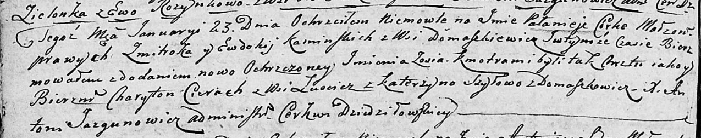

**Шило Катерына (Szyłowa Katerzyna)**

23 января 1805 г -- крестная мать Паланеи Зоси, дочери Каминских
Змитрока и Евдокии с деревни Домашковичи (НИАБ 136-13-894, лист 56об,
№11/1805-р (ориг)).

**НИАБ 136-13-894:** Лист 56об. **Метрическая запись №11/1805-р
(ориг).**

Дедиловичская Покровская церковь. 23 января 1805 года. Метрическая
запись о крещении.

Kaminska Palanieja Zosia -- дочь родителей с деревни Домашкoвичи.

Kaminski Zmitrok -- отец.

Kaminska Ewdokija -- мать.

Cierach Charyton -- кум, с деревни Лустичи.

Szyłowa Katerzyna -- кума, с деревни Домашкoвичи.

Jazgunowicz Antoni -- ксёндз.
