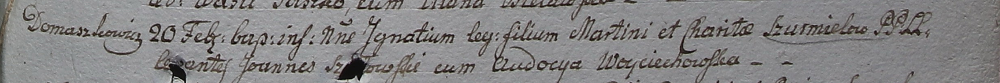

**Шурмель Харита (Szurmelowa Charita)**

20 февраля 1799 г -- крещение сына Игнатыя (НИАБ 1781-27-199, лист 125,
№16/1799-р).

**НИАБ 1781-27-199:** Лист 125. **Метрическая запись №16/1799-р.**

Дедиловичский костел Наисвятейшего Сердца Иисуса. 20 февраля 1799 года.
Метрическая запись о крещении.

Szurmel Jgnaty -- сын крестьян с деревни Домашковичи.

Szurmel Martin -- отец.

Szurmelowa Charita -- мать.

Szydłowski Joann -- крестный отец.

Woyciechowska Audocya - крестная мать.

Linhart Hyacinthus -- ксёндз.
