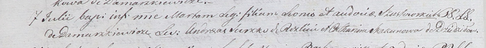

**Шустовская Марта Леонова (Szustowska Marta)**

7 июля 1801 -- крещение (НИАБ 937-4-32, лист 4об, №13/1801-р).

**НИАБ 937-4-32:** Лист 4об. **Метрическая запись №13/1801-р.**

Дедиловичский костел Наисвятейшего Сердца Иисуса. 7 июля 1801 года.
Метрическая запись о крещении.

Szustowska Marta -- дочь родителей с деревни Домашковичи.

Szustowski Leon -- отец.

Szustowska Audocia -- мать.

Suszko Andreas -- крестный отец, с деревни Разлитье.

Skakunowa Catharina -- крестная мать, с деревни Дедиловичи.

Linhart Hyacinthus -- ксёндз.
