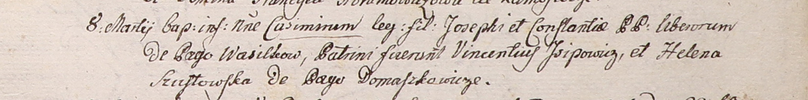

**Шустовская Елена (Szustowska Helena)**

8 марта 1801 -- крестная мать Казимира, сына вольных людей Иосифа и
Констанции с деревни Васильковка (НИАБ 937-4-32, лист 4, №8/1801-р).

**НИАБ 937-4-32:** Лист 4. **Метрическая запись №8/1801-р.**

Дедиловичский костел Наисвятейшего Сердца Иисуса. 8 марта 1801 года.
Метрическая запись о крещении.

Casimir -- сын вольных людей с деревни Васильковка.

Joseph -- отец.

Constantia -- мать.

Jsipowicz Vincentiusz -- крестный отец.

Szustowska Helena -- крестная мать, с деревни Домашковичи.

Linhart Hyacinthus -- ксёндз.
