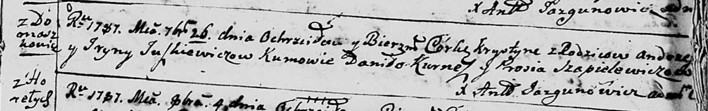

**Юшкевич Хрыстына Андреева (Juszkiewiczowna Krystyna)**

26 сентября 1787 -- крещение (НИАБ 136-13-894, лист 3, №52/1787-р
(ориг)).

**НИАБ 136-13-894:** Лист 3. **Метрическая запись №52/1787-р (ориг).**

{width="6.496527777777778in"
height="1.0258737970253717in"}

Дедиловичская Покровская церковь. 26 сентября 1787 года. Метрическая
запись о крещении.

Juszkiewiczowna Krystyna -- дочь родителей с деревни Домашковичи.

Juszkiewicz Andrzej -- отец.

Juszkiewiczowa Jryna -- мать.

Kurnesz Daniło - кум.

Szapielewiczowa Prosia - кума.

Jazgunowicz Antoni -- ксёндз.
