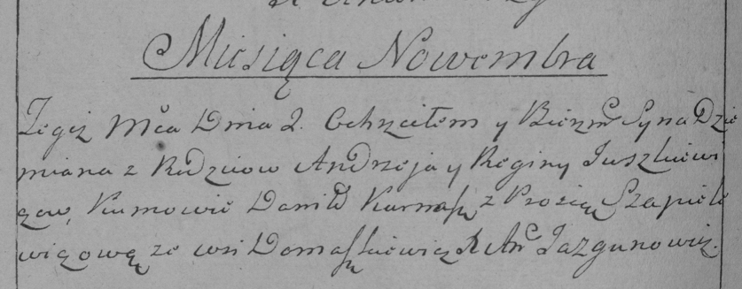

**Юшкевич Регина (Juszkiewiczowa Regina)**

2 ноября 1784 г -- крещение сына Демьяна (РГИА 823-2-18, лист 227об,
№23/1784-р (коп)).

**РГИА 823-2-18:** Лист 227об. **Метрическая запись №23/1784-р (коп).**

{width="6.496527777777778in"
height="2.5381944444444446in"}

Дедиловичская Покровская церковь. 2 ноября 1784 года. Метрическая запись
о крещении.

Juszkiewicz Dzemian -- сын родителей с деревни Домашковичи.

Juszkiewicz Andrzey -- отец.

Juszkiewiczowa Regina -- мать.

Kurnasz Daniło -- кум.

Szapielewiczowa Prosia - кума.

Jazgunowicz Antoni -- ксёндз.
