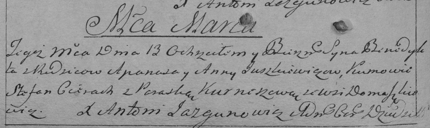

**Юшкевич Анна (Juszkiewiczowa Anna)**

9 января 1790 -- крещение сына Степана (НИАБ 136-13-894, лист 8об,
№4/1790-р (ориг)).

13 марта 1793 г -- крещение сына Бенедыкта (НИАБ 136-13-894, лист 19об,
№31/1793-р (ориг)), (РГИА 823-2-18, лист 246об, №11/1793-р (коп)).

4 августа 1802 г -- крещение сына Николая (НИАБ 937-4-32, лист 7,
№22/1802-р).

7 мая 1805 г -- крещение сына Теодора Игнация (НИАБ 136-13-894, лист 57,
№24/1805-р (ориг)).

**НИАБ 136-13-894:** Лист 8об. **Метрическая запись №4/1790-р (ориг).**

{width="6.496527777777778in"
height="0.9608344269466317in"}

Дедиловичская Покровская церковь. 9 января 1790 года. Метрическая запись
о крещении.

Juszkiewicz Stefan -- сын родителей с деревни Домашкович.

Juszkiewicz Apanas -- отец.

Juszkiewiczowa Anna -- мать.

Cierach Stefan - кум.

Kurneszycha Parasia - кума.

Jazgunowicz Antoni -- ксёндз.

**НИАБ 136-13-894:** Лист 19-об. **Метрическая запись №31/1793-р
(ориг).**

{width="6.496527777777778in"
height="1.2551859142607174in"}

Дедиловичская Покровская церковь. 13 марта 1793 года. Метрическая запись
о крещении.

Juszkiewicz Benedykt -- сын родителей с деревни Домашковичи.

Juszkewicz Apanas -- отец.

Juszkiewiczowa Anna -- мать.

Cierach Stefan - кум.

Kurneszycha Parasia - кума.

Jazgunowicz Antoni -- ксёндз.

**РГИА 823-2-18:** Лист 246об. **Метрическая запись №11/1793-р (коп).**

{width="6.496527777777778in"
height="1.9465277777777779in"}

Дедиловичская Покровская церковь. 13 марта 1793 года. Метрическая запись
о крещении.

Juszkiewicz Benedykt -- сын родителей с деревни Домашковичи.

Juszkiewicz Apanas -- отец.

Juszkiewiczowa Anna -- мать.

Cierach Stefan -- кум.

Kurneszowa Paraska -- кума.

Jazgunowicz Antoni -- ксёндз.

**НИАБ 937-4-32:** Лист 7. **Метрическая запись №22/1802-р.**

{width="6.496527777777778in"
height="0.9902777777777778in"}

Дедиловичский костел Наисвятейшего Сердца Иисуса. 4 августа 1802 года.
Метрическая запись о крещении.

Juszkiewicz Nicołay -- сын крестьян с деревни Домашковичи.

Juszkiewicz Apanas -- отец.

Juszkiewiczowa Anna -- мать.

Cierech Stephan -- крестный отец, с деревни Лустичи.

Kurnaszowa Parasa -- крестная мать, с деревни Лустичи.

Linhart Hyacinthus -- ксёндз.

**НИАБ 136-13-894:** Лист 57. **Метрическая запись №24/1805-р (ориг).**

{width="6.496527777777778in"
height="1.2565277777777777in"}

Дедиловичская Покровская церковь. 7 мая 1805 года. Метрическая запись о
крещении.

Juszkiewicz Teodor Jgnacy -- сын родителей с деревни Домашковичи.

Juszkiewicz Apanas -- отец.

Juszkiewiczowa Anna -- мать.

Szapialewicz Lukian -- кум, с деревни Домашковичи.

Kurneszowa Parasia -- кума.

Jazgunowicz Antoni -- ксёндз.
