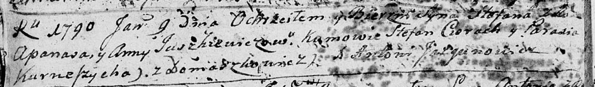

**Юшкевич Бенедыкт Апанасов (Juszkiewicz Benedykt)**

13 марта 1793 г -- крещение (НИАБ 136-13-894, лист 19об, №31/1793-р
(ориг)), (РГИА 823-2-18, лист 246об, №11/1793-р (коп)).

**НИАБ 136-13-894:** Лист 19-об. **Метрическая запись №31/1793-р
(ориг).**

{width="6.496527777777778in"
height="1.2551859142607174in"}

Дедиловичская Покровская церковь. 13 марта 1793 года. Метрическая запись
о крещении.

Juszkiewicz Benedykt -- сын родителей с деревни Домашковичи.

Juszkewicz Apanas -- отец.

Juszkiewiczowa Anna -- мать.

Cierach Stefan - кум.

Kurneszycha Parasia - кума.

Jazgunowicz Antoni -- ксёндз.

**РГИА 823-2-18:** Лист 246об. **Метрическая запись №11/1793-р (коп).**

{width="6.496527777777778in"
height="1.9465277777777779in"}

Дедиловичская Покровская церковь. 13 марта 1793 года. Метрическая запись
о крещении.

Juszkiewicz Benedykt -- сын родителей с деревни Домашковичи.

Juszkiewicz Apanas -- отец.

Juszkiewiczowa Anna -- мать.

Cierach Stefan -- кум.

Kurneszowa Paraska -- кума.

Jazgunowicz Antoni -- ксёндз.
