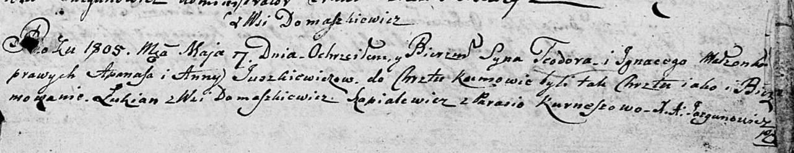

**Юшкевич Теодор Апанасов (Juszkiewicz Teodor Jgnacy)**

7 мая 1805 г -- крещение (НИАБ 136-13-894, лист 57, №24/1805-р (ориг)).

**НИАБ 136-13-894:** Лист 57. **Метрическая запись №24/1805-р (ориг).**

Дедиловичская Покровская церковь. 7 мая 1805 года. Метрическая запись о
крещении.

Juszkiewicz Teodor Jgnacy -- сын родителей с деревни Домашковичи.

Juszkiewicz Apanas -- отец.

Juszkiewiczowa Anna -- мать.

Szapialewicz Lukian -- кум, с деревни Домашковичи.

Kurneszowa Parasia -- кума.

Jazgunowicz Antoni -- ксёндз.
