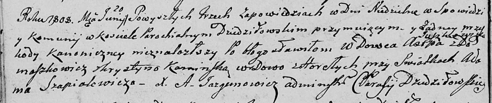

**Юшкевич Асип (Juszkiewicz Asip)**

20 июня 1808 г -- венчание с вдовой Крыстыной Каминской с деревни
Горелое (НИАБ 136-13-920, лист 13об, №2/1808-б (ориг)).

**НИАБ 136-13-894:** Лист 13об. **Метрическая запись №2/1808-б (ориг).**

Дедиловичская Покровская церковь. 20 июня 1808 года. Метрическая запись
о венчании.

Juszkiewicz Asip -- жених, вдовец, с деревни Домашковичи.

Kaminska Krystyna -- невеста, вдова, с деревни Горелое.

Szapialewicz Adam -- свидетель.

Jazgunowicz Antoni -- ксёндз.
