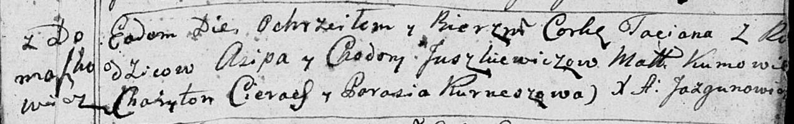

**Юшкевич Татьяна Асипова (Juszkiewiczowna Taciana)**

15 января 1792 -- крещение (НИАБ 136-13-894, лист 15, №3/1792-р (ориг)).

**НИАБ 136-13-894:** Лист 15. **Метрическая запись №3/1792-р (ориг).**

{width="6.496527777777778in"
height="1.0258737970253717in"}

Дедиловичская Покровская церковь. 15 января 1792 года. Метрическая
запись о крещении.

Juszkiewiczowna Taciana -- дочь родителей с деревни Домашковичи.

Juszkiewicz Asip -- отец.

Juszkiewiczowa Chodora -- мать.

Cierach Charyton -- кум.

Kurneszowa Parasia - кума.

Jazgunowicz Antoni -- ксёндз.
