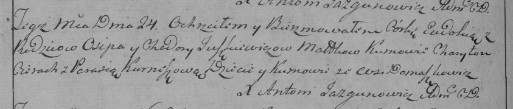

**Юшкевич (Савич) Ходора (Juszkiewiczowa Chodora, Teodora z Sawiczow)**

7 ноября 1787 г -- венчание с Асипом Юшкевичем с деревни Домашковичи
(НИАБ 136-13-894, лист 66, №6/1787-б (ориг)).

15 января 1792 -- крещение дочери Татьяны (НИАБ 136-13-894, лист 15,
№3/1792-р (ориг)).

24 февраля 1799 г -- крещение дочери Евдокии Марьяны (НИАБ 136-13-894,
лист 38об, №12/1799-р (ориг)), (РГИА 823-2-18, лист 268об, №12/1799-р
(коп), НИАБ 136-13-938, лист 241, №12/1799-р (коп)).

**НИАБ 136-13-894:** Лист 15. **Метрическая запись №3/1792-р (ориг).**

{width="6.496527777777778in"
height="1.0258737970253717in"}

Дедиловичская Покровская церковь. 15 января 1792 года. Метрическая
запись о крещении.

Juszkiewiczowna Taciana -- дочь родителей с деревни Домашковичи.

Juszkiewicz Asip -- отец.

Juszkiewiczowa Chodora -- мать.

Cierach Charyton -- кум.

Kurneszowa Parasia - кума.

Jazgunowicz Antoni -- ксёндз.

**НИАБ 136-13-894:** Лист 38об. **Метрическая запись №12/1799-р
(ориг).**

{width="6.496527777777778in"
height="1.5736767279090114in"}

Дедиловичская Покровская церковь. 24 февраля 1799 года. Метрическая
запись о крещении.

Juszkiewiczowna Ewdokija Marjana -- дочь родителей с деревни
Домашковичи.

Juszkiewicz Asip -- отец.

Juszkiewiczowa Chadora -- мать.

Cierach Charyton-- кум.

Kurnoszowa Parasia -- кума.

Jazgunowicz Antoni -- ксёндз.

**РГИА 823-2-18:** Лист 268об. **Метрическая запись №12/1799-р (коп).**

{width="6.496527777777778in"
height="1.3791666666666667in"}

Дедиловичская Покровская церковь. 24 февраля 1799 года. Метрическая
запись о крещении.

Juszkiewiczowna Eudokija -- дочь родителей с деревни Домашковичи.

Juszkiewicz Osip -- отец.

Juszkiewiczowa Chodora -- мать.

Cierach Charyton -- кум, с деревни Домашковичи.

Kurneszowa Parasia -- кума, с деревни Домашковичи.

Jazgunowicz Antoni -- ксёндз.

**НИАБ 136-13-938:** Лист 241. **Метрическая запись №12/1799-р (коп).**

(См. тж. НИАБ 136-13-894, лист 38об, №12/1799-р (ориг); РГИА 823-2-18,
лист 268об, №12/1799-р (коп))

{width="6.496527777777778in"
height="1.4152777777777779in"}

Дедиловичская Покровская церковь. 24 февраля 1799 года. Метрическая
запись о крещении.

Juszkiewiczowna Ewdokia Xienia -- дочь родителей с деревни Домашковичи.

Juszkiewicz Asip -- отец.

Juszkiewiczowa Chodora -- мать.

Cierach Charyton -- кум, с деревни Лустичи.

Kurneszowa Parasia - кума, с деревни Лустичи.

Jazgunowicz Antoni -- ксёндз.
