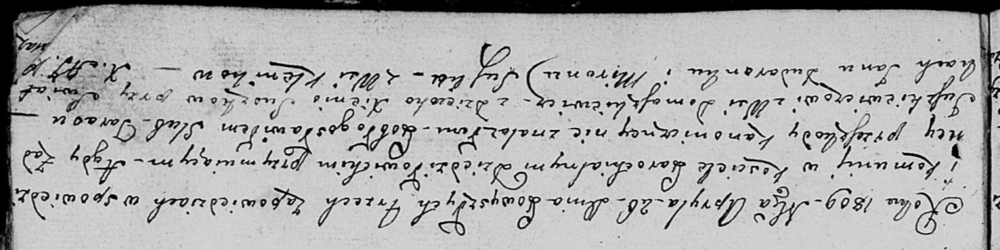

**Юшкевич (Сушко) Ксеня (Juszkiewiczowa Xienia z Suszkow)**

26 апреля 1809 г -- венчание с Тарасом Юшкевичем с деревни Домашковичи
(НИАБ 136-13-920, лист 15, №8/1809-б (ориг)).

**НИАБ 136-13-920:** Лист 15. **Метрическая запись №8/1809-б (ориг).**

{width="6.496527777777778in"
height="1.6286581364829396in"}

Дедиловичская Покровская церковь. 26 апреля 1809 года. Метрическая
запись о венчании.

Juszkiewicz Taras -- жених, с деревни Домашковичи.

Suszkowa Xienia -- невеста, девка.

Dudaronek Jan -- свидетель.

Suszko Miron -- свидетель, с деревни Клинники.

Jazgunowicz Antoni -- ксёндз.
