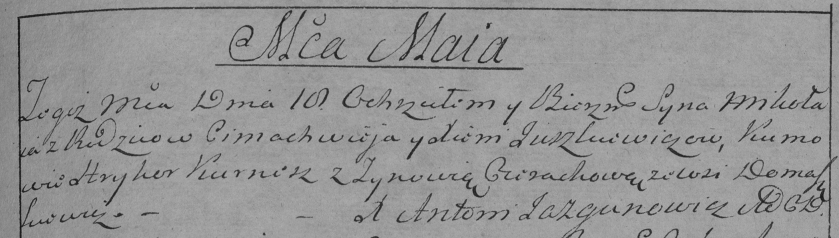

**Юшкевич Миколай Цимахвеев (Juszkiewicz Mikołay)**

18 мая 1791 г -- крещение (НИАБ 136-13-894, лист 13, №19/1791-р (ориг)),
(РГИА 823-2-18, лист 242, №10/1791-р (коп)).

**НИАБ 136-13-894:** Лист 13. **Метрическая запись №19/1791-р (ориг).**

{width="6.496527777777778in"
height="0.8562357830271216in"}

Дедиловичская Покровская церковь. 18 мая 1791 года. Метрическая запись о
крещении.

Juszkiewicz Mikołaj -- сын родителей с деревни Домашковичи.

Juszkiewicz Cimachwiej -- отец.

Juszkiewiczowa Xienia -- мать.

Kurnesz Hryhor - кум.

Cierachowa Zynowija - кума.

Jazgunowicz Antoni -- ксёндз.

**РГИА 823-2-18:** Лист 242. **Метрическая запись №10/1791-р (коп).**

{width="6.496527777777778in"
height="1.8430555555555554in"}

Дедиловичская Покровская церковь. 18 мая 1791 года. Метрическая запись о
крещении.

Juszkiewicz Mikoła -- сын родителей с деревни Домашковичи.

Juszkiewicz Cimachwiey -- отец.

Juszkiewiczowa Xienia -- мать.

Kurnesz Hryhor -- кум.

Cierachowa Zynowia - кума.

Jazgunowicz Antoni -- ксёндз.
