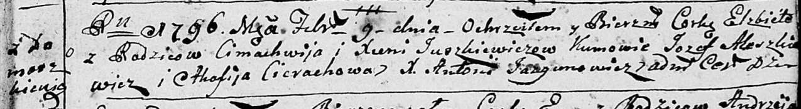

**Юшкевич Параскевья Цимахвеева (Juszkiewiczowna Paraskiewija)**

23 октября 1782г -- крещение (РГИА 823-2-18, лист 222об, №10/1782-р
(коп)).

**РГИА 823-2-18:** Лист 222об. **Метрическая запись №10/1782-р (коп).**

{width="6.496527777777778in"
height="1.4604166666666667in"}

Дедиловичская Покровская церковь. 23 октября 1782 года. Метрическая
запись о крещении.

Juszkiewiczowna Paraskiewia -- дочь родителей с деревни Домашковичи.

Juszkiewicz Cimachwiey -- отец.

Juszkiewiczowa Xienia -- мать.

Kurnos(z) Hryhor -- кум.

Cimochowa Jryna - кума.

Jazgunowicz Antoni -- ксёндз.
