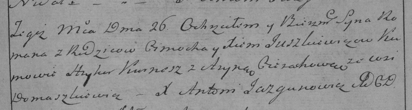

**Юшкевич Роман Цимахвеев (Juszkiewicz Roman)**

26 июля 1786 г -- крещение (РГИА 823-2-18, лист 232, №19/1786-р (коп)).

Лист 232. **Метрическая запись №19/1786-р (коп).**

Дедиловичская Покровская церковь. 26 июля 1786 года. Метрическая запись
о крещении.

Juszkiewicz Roman -- сын родителей с деревни Домашковичи.

Juszkiewicz Cimoch -- отец.

Juszkiewiczowa Xienia -- мать.

Kurnesz Hryhor -- кум.

Cierachowa Aryna - кума.

Jazgunowicz Antoni -- ксёндз.
