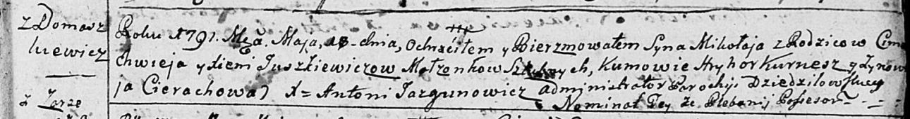

**Юшкевич Цимахвей (Juszkiewicz Cimoch, Cimachwiey)**

23 октября 1782 г -- крещение дочери Параскевьи (РГИА 823-2-18, лист
222об, №10/1782-р (коп)).

26 июля 1786 г -- крещение сына Романа (РГИА 823-2-18, лист 232,
№19/1786-р (коп)).

18 мая 1791 г -- крещение сына Миколая (НИАБ 136-13-894, лист 13,
№19/1791-р (ориг)), (РГИА 823-2-18, лист 242, №10/1791-р (коп)).

9 февраля 1796 г -- крещение дочери Елисаветы (НИАБ 136-13-894, лист 28,
№18/1796-р (ориг)).

**РГИА 823-2-18:** Лист 222об. **Метрическая запись №10/1782-р (коп).**

{width="6.496527777777778in"
height="1.4604166666666667in"}

Дедиловичская Покровская церковь. 23 октября 1782 года. Метрическая
запись о крещении.

Juszkiewiczowna Paraskiewia -- дочь родителей с деревни Домашковичи.

Juszkiewicz Cimachwiey -- отец.

Juszkiewiczowa Xienia -- мать.

Kurnos(z) Hryhor -- кум.

Cimochowa Jryna - кума.

Jazgunowicz Antoni -- ксёндз.

Лист 232. **Метрическая запись №19/1786-р (коп).**

{width="6.496527777777778in"
height="1.7472222222222222in"}

Дедиловичская Покровская церковь. 26 июля 1786 года. Метрическая запись
о крещении.

Juszkiewicz Roman -- сын родителей с деревни Домашковичи.

Juszkiewicz Cimoch -- отец.

Juszkiewiczowa Xienia -- мать.

Kurnesz Hryhor -- кум.

Cierachowa Aryna - кума.

Jazgunowicz Antoni -- ксёндз.

**НИАБ 136-13-894:** Лист 13. **Метрическая запись №19/1791-р (ориг).**

{width="6.496527777777778in"
height="0.8562357830271216in"}

Дедиловичская Покровская церковь. 18 мая 1791 года. Метрическая запись о
крещении.

Juszkiewicz Mikołaj -- сын родителей с деревни Домашковичи.

Juszkiewicz Cimachwiej -- отец.

Juszkiewiczowa Xienia -- мать.

Kurnesz Hryhor - кум.

Cierachowa Zynowija - кума.

Jazgunowicz Antoni -- ксёндз.

**РГИА 823-2-18:** Лист 242. **Метрическая запись №10/1791-р (коп).**

{width="6.496527777777778in"
height="1.8430555555555554in"}

Дедиловичская Покровская церковь. 18 мая 1791 года. Метрическая запись о
крещении.

Juszkiewicz Mikoła -- сын родителей с деревни Домашковичи.

Juszkiewicz Cimachwiey -- отец.

Juszkiewiczowa Xienia -- мать.

Kurnesz Hryhor -- кум.

Cierachowa Zynowia - кума.

Jazgunowicz Antoni -- ксёндз.

Лист 28. **Метрическая запись №18/1796-р (ориг).**

{width="6.496527777777778in"
height="0.8917727471566054in"}

Дедиловичская Покровская церковь. 9 февраля 1796 года. Метрическая
запись о крещении.

Juszkiewiczowna Elżbieta -- дочь родителей с деревни Домашковичи.

Juszkiewicz Cimachwiey -- отец.

Juszkiewiczowa Xienia -- мать.

Aleszkiewicz Jozef - кум.

Cierachowa Ahafija - кума.

Jazgunowicz Antoni -- ксёндз.
