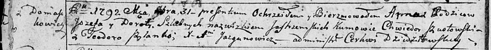

**Ястжембская Анна Иосифова (Jastrzemska Anna)**

31 октября 1792 г -- крещение (НИАБ 136-13-894, лист 17об, №71/1792-р
(ориг)).

**НИАБ 136-13-894:** Лист 17-об. **Метрическая запись №71/1792-р
(ориг).**

{width="6.496527777777778in"
height="0.6638003062117236in"}

Дедиловичская Покровская церковь. 31 октября 1792 года. Метрическая
запись о крещении.

Jastrzemska Anna -- дочь родителей с деревни Домашковичи.

Jastrzemski Jozef -- отец.

Jastrzemska Dorota -- мать.

Szustowski Chwiedor - кум.

Szyłanko Teodora - кума.

Jazgunowicz Antoni -- ксёндз.
