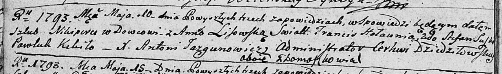

**(Лисовская) Анна (Anna z Lisowskich)**

10 мая 1793 г -- венчание с Никипером с деревни Домашковичи (НИАБ
136-13-894, лист 71об, №1/1793-б (ориг).

**НИАБ 136-13-894:** Лист 71об. **Метрическая запись №1/1793-б (ориг).**

Дедиловичская Покровская церковь. 10 мая 1793 года. Метрическая запись о
венчании.

Nikiper -- жених, вдовец, с деревни Домашковичи.

Lisowska Anna -- невеста, с деревни Домашковичи.

Hałaunia Francis -- свидетель.

Suszko Stefan -- свидетель.

Kikiło Pawłuk -- свидетель.

Jazgunowicz Antoni -- ксёндз.
