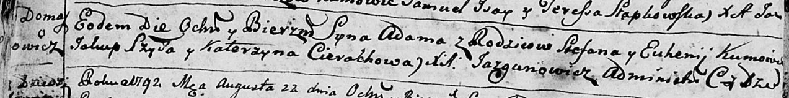

**Степан (Stefan)**

15 августа 1792 г -- крещение сына Адама (НИАБ 136-13-894, лист 16об,
№47/1792-р (ориг).

**НИАБ 136-13-894:** Лист 16об. **Метрическая запись №47/1792-р
(ориг).**

{width="6.496527777777778in"
height="0.8166754155730533in"}

Дедиловичская Покровская церковь. 15 августа 1792 года. Метрическая
запись о крещении.

Adam -- сын родителей с деревни Домашковичи.

Stefan -- отец.

Euhenija -- мать.

Szyło Jakup - кум.

Cierachowa Katerzyna - кума.

Jazgunowicz Antoni -- ксёндз.
