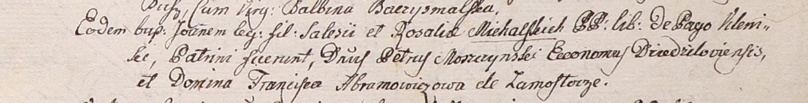

**Абрамович Франциска (Abramowiczowa Franciska)**

5 февраля 1801 г -- крестная мать Иоанна, сына вольных людей Салезыя и
Розалии Михальских с деревни Клинники (НИАБ 937-4-32, лист 5,
№7/1800-р).

**НИАБ 937-4-32:** Лист 4. **Метрическая запись №7/1801-р.**

Дедиловичский костел Наисвятейшего Сердца Иисуса. 5 февраля 1801 года.
Метрическая запись о крещении.

Michalski Joann -- сын вольных людей с деревни Клинники.

Michalski Salesi -- отец.

Michalska Rosalia -- мать.

Moszczynski Petrus -- крестный отец, шляхтич, эконом Дедиловичский.

Abramowiczowa Franciszka -- крестная мать, шляхтянка, с деревни
Замосточье.

Linhart Hyacinthus -- ксёндз.
