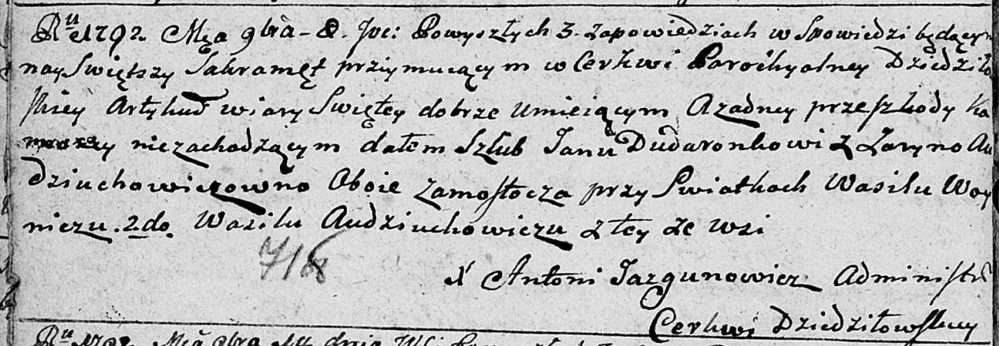

**Авдюхович (Дударёнок) Ирына (Dudaronkowa Jaryna z Audziuchowiczow)**

8 ноября 1792 г -- венчание с Ярыной Авдюхович с деревни Замосточье
(НИАБ 136-13-894, лист 71об, №20/1792-б (ориг)).

Лист 71об. **Метрическая запись №20/1792-б (ориг).**

{width="6.496527777777778in"
height="2.2508869203849518in"}

Дедиловичская Покровская церковь. 8 ноября 1792 года. Метрическая запись
о венчании.

Dudaronek Jan -- жених, с деревни Замосточье.

Audziuchowiczowna Jaryna -- невеста, с деревни Замосточье.

Woynicz Wasil -- свидетель.

Audziuchowicz Wasil -- свидетель, с деревни Замосточье.

Jazgunowicz Antoni -- ксёндз.
