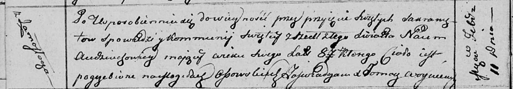

**Авдюхович Наум (Audziuchowicz Naum)**

11 февраля 1812 г -- отпевание, умер в возрасте 87 лет (родился около
1725 г) (НИАБ 136-13-919, лист 23об, №3/1812-у (ориг)).

**НИАБ 136-13-919:** Лист 23об. **Метрическая запись №3/1812-у (ориг).**

Осовская униатская церковь. 11 февраля 1812 года. Метрическая запись об
отпевании.

Audziuchowicz Naum -- умерший, 87 лет, с деревни Замосточье, похоронен
на кладбище деревни Осово.

Woyniewicz Tomasz -- ксёндз.
