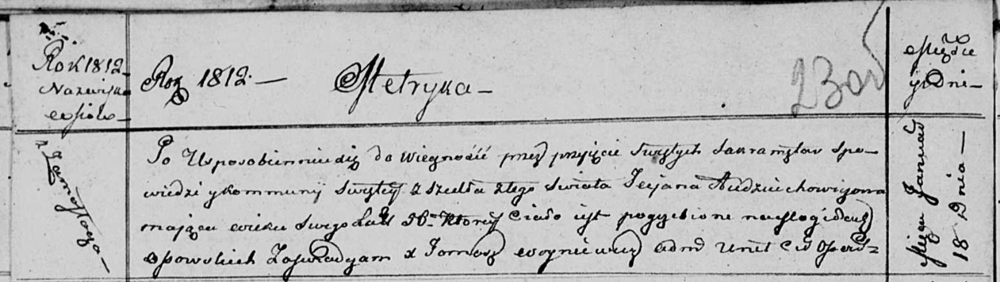

**Авдюхович Татьяна (Audziuchowiczowa Taciana)**

18 января 1812 г -- отпевание, умерла в возрасте 56 лет (родилась около
1755 г) (НИАБ 136-13-919, лист 23об, №1/1811-б (ориг)).

**НИАБ 136-13-919:** Лист 23об. **Метрическая запись №1/1812-у (ориг).**

Осовская униатская церковь. 18 января 1812 года. Метрическая запись об
отпевании.

Audziuchowiczowa Taciana -- умершая, 56 лет, с деревни Замосточье,
похоронена на кладбище деревни Осово.

Woyniewicz Tomasz -- ксёндз.
