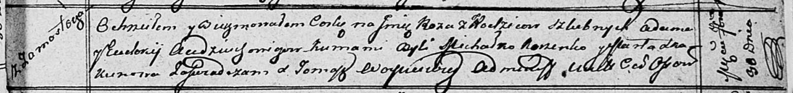

**Авдюхович Евдокия (Audziuchowiczowa Eudokija)**

30 сентября 1812 г -- крещение дочери Розы (НИАБ 136-13-894, лист 85,
№46/1812-р (ориг)).

**НИАБ 136-13-894:** Лист 85. **Метрическая запись №46/1812-р (ориг).**

Осовская Покровская церковь. 30 сентября 1812 года. Метрическая запись о
крещении.

Audziuchowiczowna Roza -- дочь родителей с деревни Замосточье.

Audziuchowicz Adam -- отец.

Audziuchowiczowa Eudokija -- мать.

Korzenko? Michałko -- кум.

Skakunowa Marta -- кума.

Woyniewicz Tomasz -- ксёндз.
