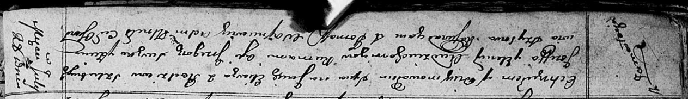

**Авдюхович Елена (Audziuchowiczowa Elena)**

28 июля 1812 г -- крещение сына Ильи (НИАБ 136-13-894, лист 84об,
№36/1812-р (ориг)).

**НИАБ 136-13-894:** Лист 84об. **Метрическая запись №36/1812-р
(ориг).**

Осовская Покровская церковь. 28 июля 1812 года. Метрическая запись о
крещении.

Audziuchowicz Eliasz -- сын родителей с деревни Замосточье.

Audziuchowicz Jozef -- отец.

Audziuchowiczowa Elena -- мать.

Suszko Grzegorz -- кум.

Szyłowa Zienowija -- кума.

Woyniewicz Tomasz -- ксёндз.
