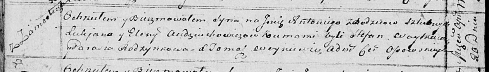

**Авдюхович Антоний Лукьянов (Audziuchowicz Antoni)**

20 апреля 1815 г -- крещение (НИАБ 136-13-894, лист 92об, №25/1815-р
(ориг)).

**НИАБ 136-13-894:** Лист 92об. **Метрическая запись №25/1815-р
(ориг).**

Осовская Покровская церковь. 20 апреля 1815 года. Метрическая запись о
крещении.

Audziuchowicz Antoni -- сын родителей с деревни Замосточье.

Audziuchowicz Łukjan -- отец.

Audziuchowiczowa Elena -- мать.

Woytkiewicz Stefan -- кум.

Rozynkowa Parasia -- кума.

Woyniewicz Tomasz -- ксёндз.
