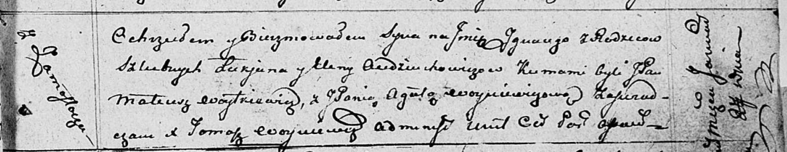

**Авдюхович Игнацы Лукьянов (Audziuchowicz Jgnacy)**

27 января 1812 г -- крещение (НИАБ 136-13-894, лист 83, №6/1812-р
(ориг)).

**НИАБ 136-13-894:** Лист 83. **Метрическая запись №6/1812-р (ориг).**

{width="6.496527777777778in"
height="1.2565277777777777in"}

Осовская Покровская церковь. 27 января 1812 года. Метрическая запись о
крещении.

Audziuchowicz Jgnacy -- сын родителей с деревни Замосточье.

Audziuchowicz Łukjan -- отец.

Audziuchowiczowa Elena -- мать.

Woytkiewicz Mateusz, JP -- кум, шляхтич.

Woyniewiczowa Agata -- кума.

Woyniewicz Tomasz -- ксёндз.
