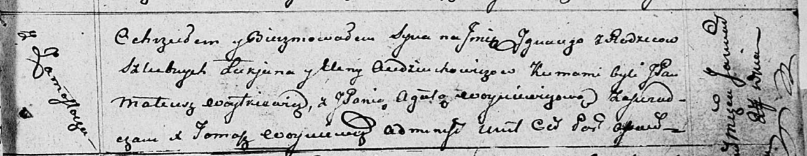

**Авдюхович Лукьян (Audziuchowicz Łukjan)**

1 ноября 1808 г -- свидетель венчания Кожемяки Сымона с деревни
Замосточье с Юстыной Стралковской с деревни Замосточье (НИАБ 136-13-920,
лист 14, №9/1808-б (ориг)).

8 августа 1809 г -- крещение сына Мацея (НИАБ 136-13-894, лист 75,
№39/1809-р (ориг)).

27 января 1812 г -- крещение сына Игнацыя (НИАБ 136-13-894, лист 83,
№6/1812-р (ориг)).

20 апреля 1815 г -- крещение сына Антония (НИАБ 136-13-894, лист 92об,
№25/1815-р (ориг)).

9 мая 1820 г -- отпевание, умер в возрасте 43 лет (родился около 1777 г)
(НИАБ 136-13-919, лист 33об, №11/1820-у (ориг)).

**НИАБ 136-13-894:** Лист 14. **Метрическая запись №9/1808-б (ориг).**

{width="6.496527777777778in"
height="1.3229068241469817in"}

Дедиловичская Покровская церковь. 1 ноября 1808 года. Метрическая запись
о венчании.

Każamiaka Symon -- жених, с деревни Замосточье.

Strałkowska Justyna -- невеста, с деревни Замосточье.

Randak Filip -- свидетель, с деревни Замосточье.

Audziuchowicz Łukjan -- свидетель, с деревни Замосточье.

Jazgunowicz Antoni -- ксёндз.

**НИАБ 136-13-894:** Лист 75. **Метрическая запись №39/1809-р (ориг).**

{width="6.496527777777778in"
height="1.2397648731408575in"}

Дедиловичская Покровская церковь. 8 августа 1809 года. Метрическая
запись о крещении .

Audziuchowicz Maciey -- сын родителей с деревни Замосточье.

Audziuchowicz Łukian -- отец.

Audziuchowiczowa Elena -- мать.

Woytkiewicz Mikołay -- кум.

Rozynkowa Prosia -- кума.

Jazgunowicz Antoni -- ксёндз.

**НИАБ 136-13-894:** Лист 83. **Метрическая запись №6/1812-р (ориг).**

{width="6.496527777777778in"
height="1.2565277777777777in"}

Осовская Покровская церковь. 27 января 1812 года. Метрическая запись о
крещении.

Audziuchowicz Jgnacy -- сын родителей с деревни Замосточье.

Audziuchowicz Łukjan -- отец.

Audziuchowiczowa Elena -- мать.

Woytkiewicz Mateusz, JP -- кум, шляхтич.

Woyniewiczowa Agata -- кума.

Woyniewicz Tomasz -- ксёндз.

**НИАБ 136-13-894:** Лист 92об. **Метрическая запись №25/1815-р
(ориг).**

{width="6.496527777777778in"
height="0.9688801399825022in"}

Осовская Покровская церковь. 20 апреля 1815 года. Метрическая запись о
крещении.

Audziuchowicz Antoni -- сын родителей с деревни Замосточье.

Audziuchowicz Łukjan -- отец.

Audziuchowiczowa Elena -- мать.

Woytkiewicz Stefan -- кум.

Rozynkowa Parasia -- кума.

Woyniewicz Tomasz -- ксёндз.

**НИАБ 136-13-919:** Лист 33об. **Метрическая запись №11/1820-у
(ориг).**

{width="6.496527777777778in"
height="1.04375in"}

Осовская униатская церковь. 9 мая 1820 года. Метрическая запись об
отпевании.

Audziuchowicz Łukjan -- умерший, 43 года, с деревни Замосточье,
похоронен на кладбище деревни Осово.

Woyniewicz Tomasz -- ксёндз.
