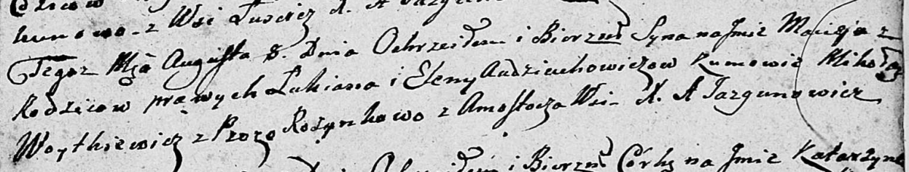
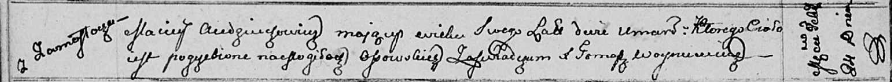

**Авдюхович Мацей Лукьянов (Audziuchowicz Maciey)**

8 августа 1809 г -- крещение (НИАБ 136-13-894, лист 75, №39/1809-р
(ориг)).

24 февраля 1811 г -- отпевание, умер в возрасте 2 лет (НИАБ 136-13-919,
лист 22об, №8/1811-у (ориг)).

**НИАБ 136-13-894:** Лист 75. **Метрическая запись №39/1809-р (ориг).**

Дедиловичская Покровская церковь. 8 августа 1809 года. Метрическая
запись о крещении .

Audziuchowicz Maciey -- сын родителей с деревни Замосточье.

Audziuchowicz Łukian -- отец.

Audziuchowiczowa Elena -- мать.

Woytkiewicz Mikołay -- кум.

Rozynkowa Prosia -- кума.

Jazgunowicz Antoni -- ксёндз.

**НИАБ 136-13-919:** Лист 22об. **Метрическая запись №8/1811-у (ориг).**

Осовская униатская церковь. 24 февраля 1811 года. Метрическая запись об
отпевании.

Audziuchowecz Maciey -- умерший, 2 года, с деревни Замосточье, похоронен
на кладбище деревни Осово.

Woyniewicz Tomasz -- ксёндз.
