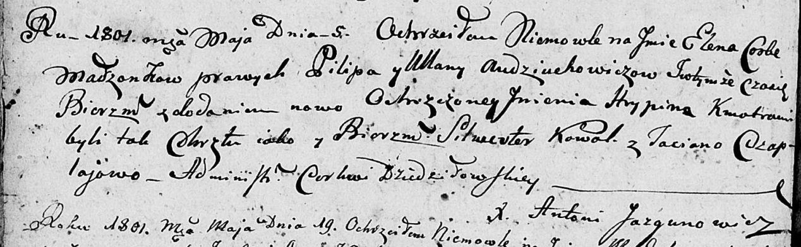

**Авдюхович Елена Пилипова (Audziuchowiczowna Elena Hrypina)**

5 мая 1801 г -- крещение (НИАБ 136-13-894, лист 43об, №12/1801-р
(ориг)).

**НИАБ 136-13-894:** Лист 34. **Метрическая запись №47/1797-р (ориг).**

{width="6.496527777777778in"
height="1.1894772528433946in"}

Дедиловичская Покровская церковь. 25 июля 1797 года. Метрическая запись
о крещении.

Audziuchowiczowna Krystyna -- дочь родителей с деревни Замосточье.

Audziuchowicz Filip -- отец.

Audziuchowiczowa Ullana -- мать.

Kawal Sylwester - кум.

Czaplaiowa Taciana - кума.

Jazgunowicz Antoni -- ксёндз.

**НИАБ 136-13-894:** Лист 43об. **Метрическая запись №12/1801-р
(ориг).**

{width="6.496527777777778in"
height="2.008163823272091in"}

Дедиловичская Покровская церковь. 5 мая 1801 года. Метрическая запись о
крещении.

Audziuchowiczowna Elena Hrypina -- дочь родителей \[с деревни
Замосточье\].

Audziuchowicz Pilip -- отец.

Audziuchowiczowa Ullana -- мать.

Kowal Silwester -- кум.

Czaplajowa Taciana -- кума.

Jazgunowicz Antoni -- ксёндз.
