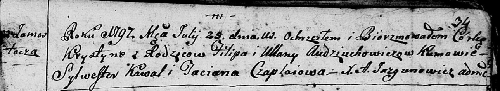

**Авдюхович Хрыстына Пилипова (Audziuchowiczowna Krystyna)**

25 июля 1797 г -- крещение (НИАБ 136-13-894, лист 34, №47/1797-р
(ориг)), (РГИА 823-2-18, лист 260, №32/1797-р (коп)).

**НИАБ 136-13-894:** Лист 34. **Метрическая запись №47/1797-р (ориг).**

Дедиловичская Покровская церковь. 25 июля 1797 года. Метрическая запись
о крещении.

Audziuchowiczowna Krystyna -- дочь родителей с деревни Замосточье.

Audziuchowicz Filip -- отец.

Audziuchowiczowa Ullana -- мать.

Kawal Sylwester - кум.

Czaplaiowa Taciana - кума.

Jazgunowicz Antoni -- ксёндз.

**РГИА 823-2-18:** Лист 260. **Метрическая запись №32/1797-р (коп).**

Дедиловичская Покровская церковь. 25 июля 1797 года. Метрическая запись
о крещении.

Audziuchowiczowa Krystyna -- дочь родителей с деревни \[Замосточье\].

Audziuchowicz Filip -- отец.

Audziuchowiczowa Uljana -- мать.

Kawal Sylwester -- кум.

Czaplajowa Tacianna -- кума.

Jazgunowicz Antoni -- ксёндз.
