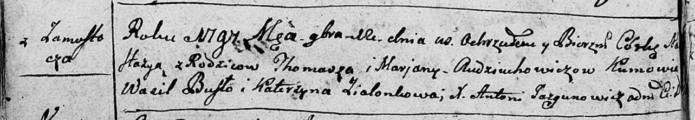

**Авдюхович Марьяна (Audziuchowiczowa Marjana)**

20 января 1796 г -- крещение сына Андрея (НИАБ 136-13-894, лист 27об,
№9/1796-р (ориг)).

12 ноября 1797 г -- крещение дочери Настасьи (НИАБ 136-13-894, лист
34об, №63/1797-р (ориг)), (РГИА 823-2-18, лист 261, №44/1797-р (коп)).

7 октября 1800 г -- крещение сына Лукаша Яна (НИАБ 136-13-894, лист 42,
№28/1800-р (ориг), НИАБ 136-13-949, лист 103об, №31/1800-р (коп)).

13 октября 1807 г -- крещение дочери Зыновии (НИАБ 136-13-894, лист
63об, №44/1807-р (ориг)).

7 октября 1810 г -- крещение дочери Уршули (НИАБ 136-13-894, лист 79,
№48/1810-р (ориг)).

**НИАБ 136-13-894:** Лист 27об. **Метрическая запись №9/1796-р (ориг).**

Дедиловичская Покровская церковь. 20 января 1796 года. Метрическая
запись о крещении.

Audziuchowicz Andrzey -- родителей с деревни Замосточье.

Audziuchowicz Tomasz -- отец.

Audziuchowiczowa Marjana -- мать.

Busło Wasil - кум.

Zielonkowa Ahapa - кума.

Jazgunowicz Antoni -- ксёндз.

**НИАБ 136-13-894:** Лист 34об. **Метрическая запись №63/1797-р
(ориг).**

Дедиловичская Покровская церковь. 12 ноября 1797 года. Метрическая
запись о крещении.

Audziuchowiczowna Nastazyja -- дочь родителей с деревни Замосточье.

Audziuchowicz Thomasz -- отец.

Audziuchowiczowa Marjana -- мать.

Busło Wasil - кум.

Zialonkowa Katerzyna - кума.

Jazgunowicz Antoni -- ксёндз.

**РГИА 823-2-18:** Лист 261. **Метрическая запись №44/1797-р (коп).**

Дедиловичская Покровская церковь. 12 ноября 1797 года. Метрическая
запись о крещении.

Audziuchowiczowa Anastazya -- дочь родителей с деревни Замосточье.

Audziuchowicz Tomasz -- отец.

Audziuchowiczowa Marjanna -- мать.

Busło Wasil -- кум.

Zielonkowa Katarzyna -- кума.

Jazgunowicz Antoni -- ксёндз.

**НИАБ 136-13-894:** Лист 42. **Метрическая запись №28/1800-р (ориг).**

Дедиловичская Покровская церковь. 7 октября 1800 года. Метрическая
запись о крещении.

Audziuchowicz Łukasz Jan -- сын родителей с деревни Замосточье.

Audziuchowicz Tomasz -- отец.

Audziuchowiczowa Marjana -- мать.

Bortnowski Piotr -- кум.

Zielonkowa Anna -- кума.

Jazgunowicz Antoni -- ксёндз.

**НИАБ 136-13-949:** Лист 103об. **Метрическая запись №31/1800-р
(коп).**

(См. тж.: НИАБ 136-13-894, лист 42, №28/1800-р (ориг))

Дедиловичская Покровская церковь. 7 октября 1800 года. Метрическая
запись о крещении.

Audziuchowicz Łukasz Jan -- сын родителей с деревни \[Замосточье\].

Audziuchowicz Tomasz -- отец.

Audziuchowiczowa Marjana -- мать.

Bortnowski Piotr -- кум, с деревни Дедиловичи.

Zielonkowa Anna - кума, с деревни Замосточье.

Jazgunowicz Antoni -- ксёндз.

**НИАБ 136-13-894:** Лист 54об. **Метрическая запись №27/1804-р
(ориг).**

Дедиловичская Покровская церковь. 6 августа 1804 года. Метрическая
запись о крещении.

Audziuchowicz Eliasz Marcin -- сын родителей с деревни Замосточье.

Audziuchowicz Tomasz -- отец.

Audziuchowiczowa Marjana -- мать, деревня Замосточье.

Randak Jozef -- кум, с деревни Замосточье.

Zielonkowa Katerzyna -- кума, с деревн Замосточье.

Jazgunowicz Antoni -- ксёндз.

**НИАБ 136-13-894:** Лист 63об. **Метрическая запись №44/1807-р
(ориг).**

Дедиловичская Покровская церковь. 13 октября 1807 года. Метрическая
запись о крещении.

Audziuchowiczowna Zynowija -- дочь родителей с деревни Замосточье.

Audziuchowicz Tomasz -- отец.

Audziuchowiczowa Marjana -- мать.

Randak Jozef -- кум.

Zalonkowa Pruzyna -- кума.

Jazgunowicz Antoni -- ксёндз.

**НИАБ 136-13-894:** Лист 79. **Метрическая запись №48/1810-р (ориг).**

Осовская Покровская церковь. 7 октября 1810 года. Метрическая запись о
крещении.

Audziuchowiczowna Urszula -- дочь родителей с деревни Замосточье.

Audziuchowicz Tomasz -- отец.

Audziuchowiczowa Marjana -- мать.

Brydko? Jozef -- кум.

Zielonkowa Anna -- кума.

Woyniewicz Tomasz -- ксёндз.
