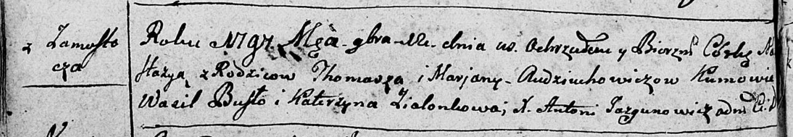

**Авдюхович Уршуля Хомова (Audziuchowiczowna Urszula)**

7 октября 1810 г -- крещение (НИАБ 136-13-894, лист 79, №48/1810-р
(ориг)).

**НИАБ 136-13-894:** Лист 79. **Метрическая запись №48/1810-р (ориг).**

{width="6.496527777777778in"
height="0.887749343832021in"}

Осовская Покровская церковь. 7 октября 1810 года. Метрическая запись о
крещении.

Audziuchowiczowna Urszula -- дочь родителей с деревни Замосточье.

Audziuchowicz Tomasz -- отец.

Audziuchowiczowa Marjana -- мать.

Brydko? Jozef -- кум.

Zielonkowa Anna -- кума.

Woyniewicz Tomasz -- ксёндз.
