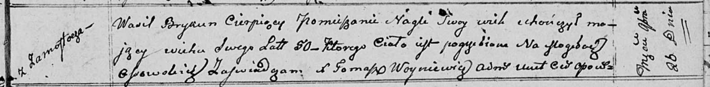

**Брыкун Василь (Brykun Wasil)**

16 ноября 1810 г -- отпевание, умер в возрасте 50 лет (родился около
1760 г) (НИАБ 136-13-919, лист 22, №11/1810-у (ориг)).

**НИАБ 136-13-919:** Лист 22. **Метрическая запись №11/1810-у (ориг).**

{width="6.496527777777778in"
height="0.8013888888888889in"}

Осовская униатская церковь. 26 ноября 1810 года. Метрическая запись об
отпевании.

Brykun Wasil -- умерший, 50 лет, с деревни Замосточье, похоронен на
кладбище деревни Осово.

Woyniewicz Tomasz -- ксёндз.
