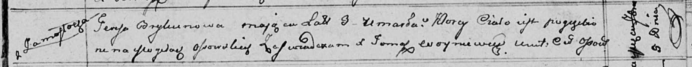

**Брыкун Тереса (Brykunowa Teresa)**

9 сентября 1811 г -- отпевание, умерла в возрасте 3 лет (родилась около
1808 г) (НИАБ 136-13-919, лист 23, №17/1811-у (ориг)).

**НИАБ 136-13-919:** Лист 23. **Метрическая запись №17/1811-у (ориг).**

{width="6.496527777777778in"
height="0.6333333333333333in"}

Осовская униатская церковь. 9 сентября 1811 года. Метрическая запись об
отпевании.

Brykunowa Teresa -- умершая, 3 года, с деревни Замосточье, похоронена на
кладбище деревни Осово.

Woyniewicz Tomasz -- ксёндз.
