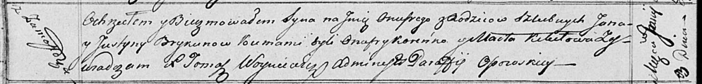

**Брыкун Ян (Brykun Jan)**

3 июня 1817 г -- крещение сына Онуфрыя (НИАБ 136-13-894, лист 96об,
№38/1817-р (ориг)).

**НИАБ 136-13-894:** Лист 96об. **Метрическая запись №38/1817-р
(ориг).**

{width="6.496527777777778in"
height="0.7811384514435695in"}

Осовская Покровская церковь. 3 июня 1817 года. Метрическая запись о
крещении.

Brykun Onufry -- сын родителей с деревни Замосточье.

Brykun Jan -- отец.

Brykunowa Justyna -- мать.

Koreńko Onufry -- кум.

Kikiłowa Marta -- кума.

Woyniewicz Tomasz -- ксёндз.
