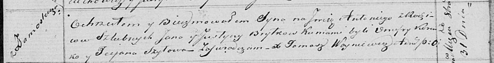

**Брытко Ян (Brytko Jan)**

31 октября 1820 г -- крещение сына Антония (НИАБ 136-13-894, лист 105,
№37/1820-р (ориг)).

**НИАБ 136-13-894:** Лист 105. **Метрическая запись №37/1820-р (ориг).**

Осовская Покровская церковь. 31 октября 1820 года. Метрическая запись о
крещении.

Brytko Antoni -- сын родителей с деревни Замосточье.

Brytko Jan -- отец.

Brytkowa Justyna -- мать.

Koreńko Onufry -- кум.

Szyłowa Taciana -- кума.

Woyniewicz Tomasz -- ксёндз.
