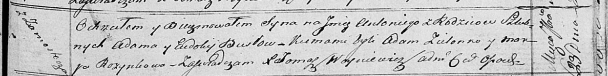

**Бусло Антоний Адамов (Busła Antoni)**

23 сентября 1817 г -- крещение (НИАБ 136-13-894, лист 97, №56/1817-р
(ориг)).

**НИАБ 136-13-894:** Лист 97. **Метрическая запись №56/1817-р (ориг).**

Осовская Покровская церковь. 23 сентября 1817 года. Метрическая запись о
крещении.

Busła Antoni -- сын родителей с деревни Замосточье.

Busła Adam -- отец.

Busłowa Eudokija -- мать.

Zielonko Adam -- кум.

Rozynkowa Marja -- кума.

Woyniewicz Tomasz -- ксёндз.
