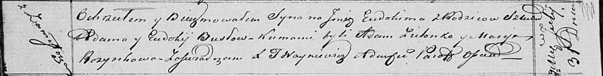

**Бусло Евдоким Адамов (Busła Eudokim)**

31 июля 1820 г -- крещение (НИАБ 136-13-894, лист 104об, №26/1820-р
(ориг)).

**НИАБ 136-13-894:** Лист 104об. **Метрическая запись №26/1820-р
(ориг).**

Осовская Покровская церковь. 31 июля 1820 года. Метрическая запись о
крещении.

Busła Eudokim -- сын родителей с деревни Замосточье.

Busła Adam -- отец.

Busłowa Eudokija -- мать.

Zielonko Adam -- кум.

Rozynkowa Marija -- кума.

Woyniewicz Tomasz -- ксёндз.
