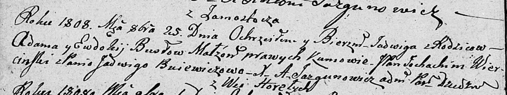

**Бусло Ядвига Адамова (Busłowa Jadwiga)**

25 октября 1808 г -- крещение (НИАБ 136-13-894, лист 72об, №39/1808-р
(ориг)).

**НИАБ 136-13-894:** Лист 72об. **Метрическая запись №39/1808-р
(ориг).**

{width="6.496527777777778in"
height="1.222331583552056in"}

Дедиловичская Покровская церковь. 25 октября 1808 года. Метрическая
запись о крещении.

Busłowna Jadwiga -- дочь родителей с деревни Замосточье.

Busła Adam -- отец.

Busłowa Ewdokija -- мать.

Wiercinski Joachim, JP -- кум, шляхтич.

Buiewiczowa Jadwiga -- кума.

Jazgunowicz Antoni -- ксёндз.
