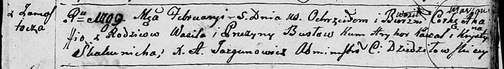
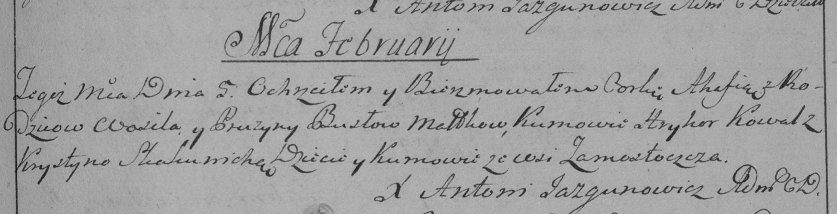
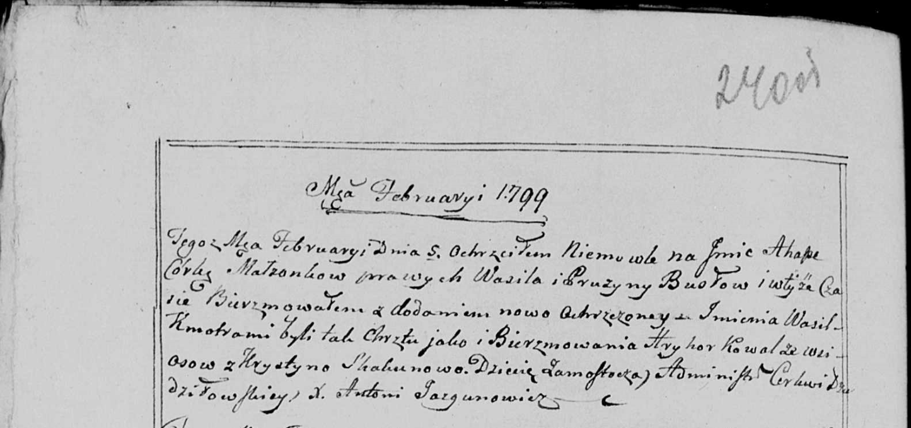

**Бусел Агафия, Агапа Василева (Busłowna Ahaffia Marjana, Ahapa)**

5 февраля 1799 г -- крещение (НИАБ 136-13-894, лист 38, №5/1799-р
(ориг)), (РГИА 823-2-18, лист 268, №5/1799-р (коп), НИАБ 136-13-938,
лист 240об, №5/1799-р (коп)).

**НИАБ 136-13-894:** Лист 38. **Метрическая запись №5/1799-р (ориг).**

Дедиловичская Покровская церковь. 5 февраля 1799 года. Метрическая
запись о крещении.

Busłowna Ahaffia Marjana -- сын родителей с деревни Замосточье.

Busło Wasil -- отец.

Busłowa Pruzyna -- мать.

Kawal Hryhor -- кум.

Skakunicha Krystyna -- кума.

Jazgunowicz Antoni -- ксёндз.

**РГИА 823-2-18:** Лист 268. **Метрическая запись №5/1799-р (коп).**

Дедиловичская Покровская церковь. 5 февраля 1799 года. Метрическая
запись о крещении.

Busłowna Ahafia -- дочь родителей с деревни Замосточье.

Busło Wasil -- отец.

Busłowa Pruzyna -- мать.

Kowal Hryhor -- кум, с деревни Замосточье.

Skakunicha Krystyna -- кума, с деревни Замосточье.

Jazgunowicz Antoni -- ксёндз.

**НИАБ 136-13-938:** Лист 240об. **Метрическая запись №5/1799-р (коп).**

(См. тж. НИАБ 136-13-894, лист 38, №5/1799-р (ориг); РГИА 823-2-18, лист
268, №5/1799-р (коп))

Дедиловичская Покровская церковь. 5 февраля 1799 года. Метрическая
запись о крещении.

Busłowa Ahapa -- дочь родителей с деревни Замосточье.

Busła Wasil -- отец.

Busłowa Pruzyna -- мать.

Kowal Hryhor -- кум, с деревни Осово.

Skakunowa Krystyna - кума.

Jazgunowicz Antoni -- ксёндз.
